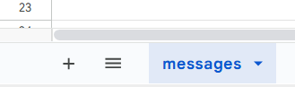
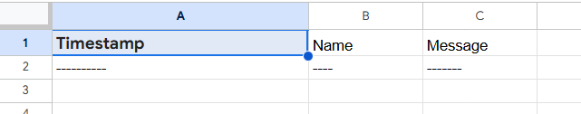
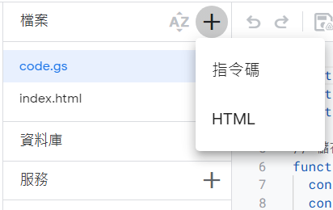

# 🐾 YM的匿名留言板

這是一個使用 **Google Apps Script + Google Sheets** 的匿名留言板，讓使用者可以匿名留言，並且將留言即時寫入 Google Sheets。
網址如下：https://script.google.com/macros/s/AKfycby3aX4XBKCTonGdVJ8P6L4lqX8JLwf86wbXfy5YjEvnIRFlnUmoq9nDNdUvgQA0jig8/exec

## 🎯 功能
✅ 使用者可以匿名留言
✅ 防止按鈕連續點擊，避免重複送出留言
✅ 自動儲存留言到 **Google Sheets**
✅ **Hover 動畫效果**，看起來很酷!

## 🏗️ 技術架構
- **前端**：HTML + CSS + JavaScript
- **後端**：Google Apps Script
- **資料庫**：Google Sheets

## 📂 架構
```
/ YM-Message-Board
├── index.html  # 前端頁面
├── Code.gs     # Google Apps Script 後端處理
└── README.md   # 專案說明文件
```

## 🚀 部署

### **1️⃣ 建立 Google 試算表**
1. **開啟 Google Sheets**（https://docs.google.com/spreadsheets/）
2. 建立一個新的試算表，並檔案名稱命名為 **留言板**(或可自行取名)，下方的 **工作表** 改名為 **messages**

3. **建立三個欄位**：
   - **A1 ：時間**
   - **B1 ：名稱**
   - **C1 ：留言**
   
4. 記下 **試算表 ID**（網址中的 `docs.google.com/spreadsheets/d/xxx/edit?...`，其中`xxx` 就是 試算表的ID）

### **2️⃣ 建立 Google Apps Script**
1. **開啟 GAS 編輯器**（https://script.google.com/）
2. 建立新專案，並貼上 `Code.gs` 內容
3. 修改 `SHEET_ID`，填入你的試算表 ID
4. 修改 'MY_TITLE`，幫自己的網站標題命名

### **3️⃣ 設定前端頁面**
1. **新增檔案 → 選HTML → 命名為index**

2. 貼上 `index.html` 內容

### **4️⃣ 部署網站**
   - 選擇 `部署` → `新部署`
   - 選擇 `Web 應用程式`
   - **存取權限** 設為 `任何人`
   - 點擊 `部署`
   - **複製網址** 完成!
